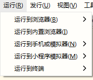

## QOShop

这是我在bilibili上学习uni-app时做的一个简单的demo，

>  Uni-App从入门到实战- https://www.bilibili.com/video/BV1BJ411W7pX

不涉及后台知识，接口来自视频评论区的热心同学。

接口地址：https://www.showdoc.com.cn/128719739414963?page_id=2513235043485226

因接口问题，暂时只实现了部分功能。

如果会vue基本语法，uni-app十分容易上手，虽然是免费教学视频，但是受益良多。

### 如何预览

下载 [HbuilderX](https://www.dcloud.io/hbuilderx.html)，安装后在工具栏 运行
如果运行在微信小程序，还需要安装 [微信开发者工具](https://developers.weixin.qq.com/miniprogram/dev/devtools/download.html)

### 预览效果

